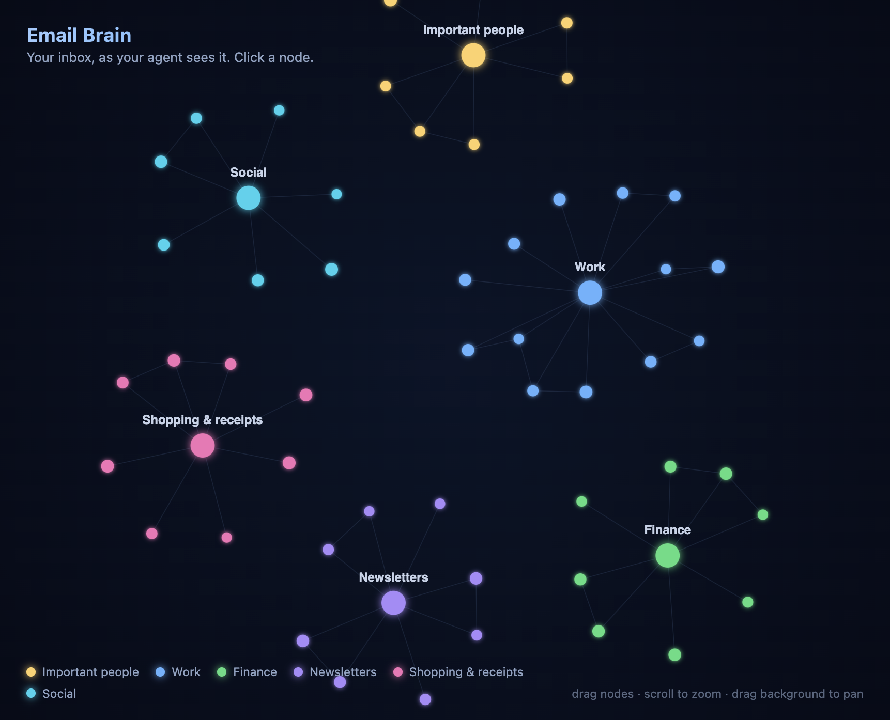

# Email Brain

A "second brain" style marketing visual: an inbox rendered as a living, glowing
graph. Emails are nodes clustered around category hubs, with extra links between
emails from the same sender. Interactive — click a node and its connections
light up.

No frameworks, no build step, no dependencies. Just static HTML/CSS/JS.



## Interactions

- **Click a node** — its connections light up, everything else dims, and a
  detail card shows the email and its links (click a link to jump to that node).
- **Hover** — preview a node's connections.
- **Drag a node** — pull it around; the physics settles it back.
- **Scroll** — zoom (zooming in reveals sender labels).
- **Drag the background** — pan.

## Run it

Either open `index.html` directly in a browser, or serve it:

```bash
python3 -m http.server 8899
# then open http://localhost:8899
```

Any static host works too (GitHub Pages, Vercel, Netlify, S3).

## Use your own data

Everything is driven by **`data.js`** — one object, `window.EMAIL_BRAIN`, with
`categories` and `emails`. Replace it with a real inbox and the graph rebuilds
itself.

**See [`DATA_GUIDE.md`](DATA_GUIDE.md)** for the full schema, categorization
heuristics, sizing tips, and how to convert a raw mailbox into `data.js`. It's
written so another agent can generate the data file automatically.

Quick shape:

```js
window.EMAIL_BRAIN = {
  categories: {
    work: { label: "Work", color: "#63b3ff" }
  },
  emails: [
    { sender: "GitHub", subject: "PR #42 merged", category: "work" }
  ]
};
```

## Files

| File            | Purpose                                                        |
| --------------- | ------------------------------------------------------------- |
| `index.html`    | Page shell + overlay UI (header, legend, detail card).        |
| `styles.css`    | Styling for the dark "neural" look.                           |
| `data.js`       | **The data.** Edit this to plug in a real inbox.              |
| `graph.js`      | Force simulation, rendering, interactions (canvas, ~380 LOC). |
| `DATA_GUIDE.md` | How to organize email data to build this UI.                  |

## Making marketing footage

Full-screen the browser and screen-record while clicking through clusters — the
highlight/dim transitions are the money shot. Aim for a few senders with 2–5
emails each so the graph has connective tissue.

## License

MIT
